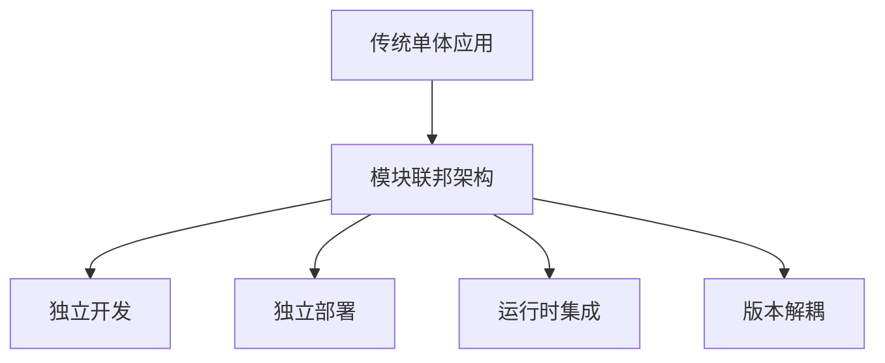
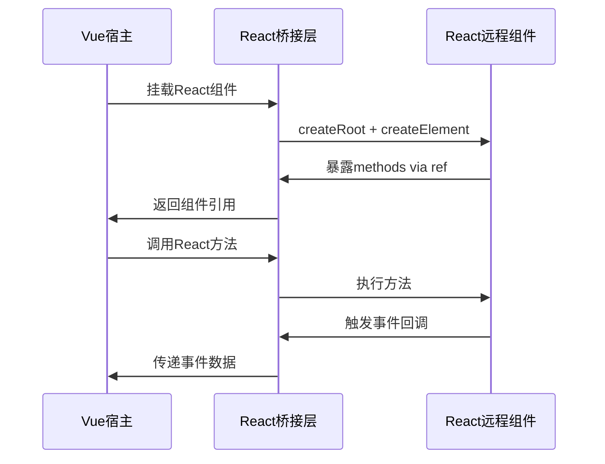
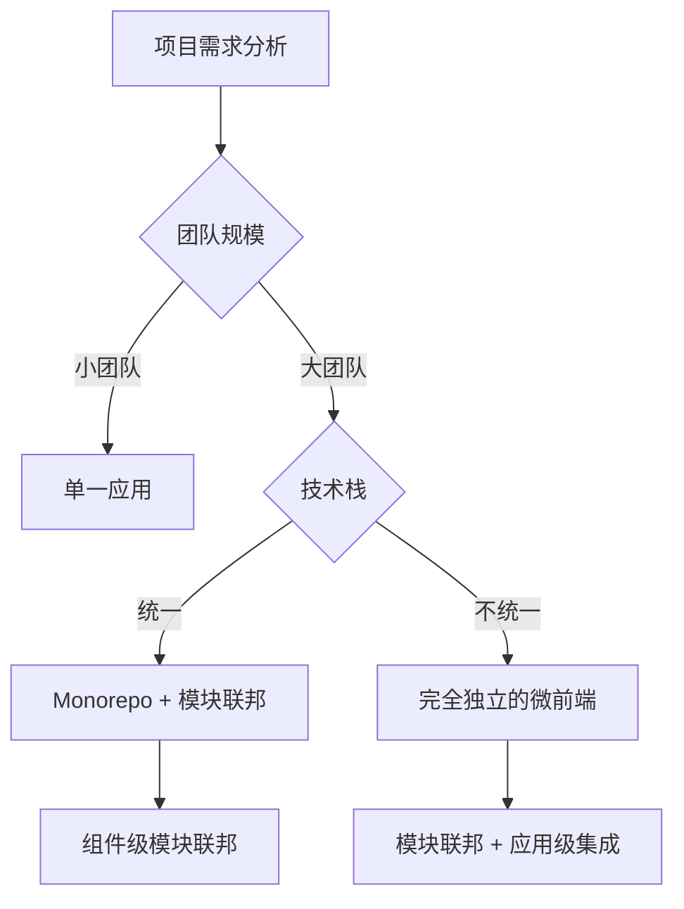
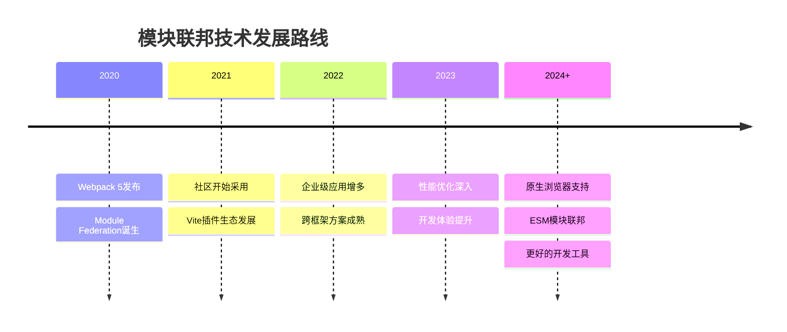

# 模块联邦学习心得：从理论到实践的完整指南

## 🎯 前言

本文档基于实际的模块联邦学习项目，从基础概念到高级应用，全面梳理模块联邦技术的核心要点和最佳实践。项目涵盖了Webpack和Vite两种主流实现方案，以及Vue与React跨框架组件共享的复杂场景。

## 📚 目录

1. [模块联邦基础理论](#模块联邦基础理论)
2. [Webpack模块联邦实现](#webpack模块联邦实现)
3. [Vite模块联邦实现](#vite模块联邦实现)
4. [跨框架模块共享](#跨框架模块共享)
5. [最佳实践与踩坑指南](#最佳实践与踩坑指南)
6. [性能优化策略](#性能优化策略)
7. [总结与展望](#总结与展望)

---

## 🏗️ 模块联邦基础理论

### 什么是模块联邦？

模块联邦(Module Federation)是一种JavaScript架构模式，允许多个独立的应用程序在运行时动态共享代码和依赖。它解决了微前端架构中的核心问题：**如何在保持应用独立性的同时实现高效的代码共享**。

### 核心概念

#### 1. Host（宿主应用）
- **作用**：消费远程模块的应用
- **特点**：决定何时何地加载远程模块
- **示例**：本项目中的 `ikun-home` 和 `host-vue`

#### 2. Remote（远程应用）
- **作用**：提供模块供其他应用使用的应用
- **特点**：暴露特定的组件或功能模块
- **示例**：本项目中的 `ikun-header`、`remote-react`、`remote-vue`

#### 3. Shared（共享依赖）
- **作用**：在不同应用间共享的库和依赖
- **特点**：避免重复加载，减少bundle体积
- **示例**：React、Vue、Lodash等公共库

### 架构优势



1. **技术栈独立**：不同团队可以使用不同的技术栈
2. **开发独立**：各应用可以独立开发、测试、部署
3. **运行时共享**：动态加载，无需重新编译整个应用
4. **版本管理**：灵活的版本控制和渐进升级

---

## ⚙️ Webpack模块联邦实现

本项目通过 `ikun-header` (远程模块) 和 `ikun-home` (宿主应用) 展示了Webpack模块联邦的经典实现。

### 远程模块配置 (ikun-header)

```javascript
// webpack.config.js
const ModuleFederationPlugin = require("webpack/lib/container/ModuleFederationPlugin");

module.exports = {
  plugins: [
    new ModuleFederationPlugin({
      name: "HeaderApp",                    // 应用名称，全局唯一
      filename: "remoteEntry.js",          // 远程入口文件名
      exposes: {
        "./Header": "./src/App",            // 暴露的模块映射
      },
      shared: {
        ...dependencies,
        react: {
          singleton: true,                  // 确保单例模式
          requiredVersion: dependencies["react"], // 版本要求
        },
        "react-dom": {
          singleton: true,
          requiredVersion: dependencies["react-dom"],
        }
      },
    })
  ]
};
```

**关键点解析**：

1. **singleton: true** - 确保React在整个应用中只有一个实例，避免hook规则冲突
2. **requiredVersion** - 指定依赖版本要求，保证兼容性
3. **exposes** - 定义暴露的模块，`"./Header"` 是外部引用路径，`"./src/App"` 是内部实际路径

### 宿主应用配置 (ikun-home)

```javascript
// webpack.config.js
new ModuleFederationPlugin({
  name: "HomeApp",
  remotes: {
    "HeaderApp": "HeaderApp@http://localhost:3001/remoteEntry.js", // 远程应用引用
  },
  shared: {
    ...dependencies,
    react: { singleton: true },
    "react-dom": { singleton: true }
  },
})
```

### 动态加载实现

```javascript
// src/App.js
import React, { Suspense, lazy } from 'react';

// 懒加载远程组件
const Header = lazy(() => import('HeaderApp/Header'));

function App() {
  return (
    <div>
      <Suspense fallback={<div>Loading Header...</div>}>
        <Header />
      </Suspense>
      <h1>Home Application</h1>
    </div>
  );
}
```

**技术要点**：

1. **lazy()** - React懒加载，实现代码分割
2. **Suspense** - 提供加载状态的用户体验
3. **错误边界** - 处理远程模块加载失败的情况

---

## 🚀 Vite模块联邦实现

Vite作为新一代构建工具，通过 `@originjs/vite-plugin-federation` 插件实现模块联邦，提供了更快的开发体验。

### Vite宿主应用配置 (host-vue)

```typescript
// vite.config.ts
import federation from "@originjs/vite-plugin-federation";

export default defineConfig({
  plugins: [
    vue(),
    federation({
      name: "host",
      filename: "remoteEntry.js",
      remotes: {
        remoteVueComponents: "http://localhost:3002/assets/remoteEntry.js",
        remoteReactComponents: "http://localhost:3001/assets/remoteEntry.js",
      },
      shared: {
        vue: {},
        react: {},
        "react-dom": {},
      },
    })
  ]
});
```

### Vite远程应用配置

#### React远程模块 (remote-react)

```typescript
// vite.config.ts
federation({
  name: "remoteReactComponents",
  filename: "remoteEntry.js",
  exposes: {
    "./Button": "./src/components/Button.tsx",
  },
  shared: ["react", "react-dom", "antd"], // 简化的共享配置
})
```

#### Vue远程模块 (remote-vue)

```typescript
// vite.config.ts
federation({
  name: "remoteVueComponents",
  filename: "remoteEntry.js", 
  exposes: {
    "./Button": "./src/components/Button.vue",
  },
  shared: {
    vue: { generate: false }, // Vue特殊配置，不生成共享模块
  },
})
```

### Webpack vs Vite 对比

| 特性 | Webpack | Vite |
|------|---------|------|
| **开发速度** | 较慢，需要完整编译 | 极快，ES模块+esbuild |
| **HMR体验** | 一般 | 极佳，毫秒级更新 |
| **配置复杂度** | 相对复杂 | 相对简单 |
| **生态成熟度** | 非常成熟，生产验证 | 较新，快速发展 |
| **入口文件路径** | `/remoteEntry.js` | `/assets/remoteEntry.js` |
| **构建产物** | 相对较大 | 更小，优化更好 |

---

## 🌉 跨框架模块共享

本项目最有价值的部分是实现了Vue宿主应用消费React远程组件，这在实际项目中非常有挑战性。

### 核心实现原理

#### 1. 全局React环境配置

```typescript
// main.ts - 关键：在Vue应用中注入React全局对象
import React from "react";
import ReactDOM from "react-dom/client";

// 防止冲突的全局变量定义
Object.defineProperty(window, "React", {
  value: React,
  writable: false,
  configurable: false,
});

Object.defineProperty(window, "ReactDOM", {
  value: ReactDOM, 
  writable: false,
  configurable: false,
});
```

#### 2. Vue中的React组件桥接

```vue
<!-- reactComponents.vue -->
<template>
  <div>
    <h3>React Components in Vue</h3>
    <div ref="reactComponent"></div>
    <button @click="callReactMethod">调用React组件方法</button>
  </div>
</template>

<script setup lang="ts">
import React from "react";
import { createRoot } from "react-dom/client";

const reactComponent = ref<HTMLDivElement>();
const reactRef = ref<any>();
const reactComponentRef = ref<any>();

// 异步加载React组件
async function loadReactComponent() {
  const Component = (await import("remoteReactComponents/Button")).default;
  return Component;
}

// 渲染React组件到Vue模板中
async function renderReactComponents() {
  if (!reactComponent.value) return;
  
  reactRef.value = createRoot(reactComponent.value);
  const Component = await loadReactComponent();
  
  // 关键：使用React.createElement在Vue中渲染React组件
  reactRef.value.render(
    React.createElement(Component, {
      ref: reactComponentRef,
      // 传递props给React组件
      initialCount: 10,
      onCountChange: (count: number) => {
        console.log('React组件计数改变:', count);
      }
    })
  );
}

// 调用React组件的方法
function callReactMethod() {
  if (reactComponentRef.value) {
    reactComponentRef.value.incrementCount();
  }
}

onMounted(renderReactComponents);
onUnmounted(() => {
  // 清理React根节点
  if (reactRef.value) {
    reactRef.value.unmount();
  }
});
</script>
```

#### 3. React组件的Ref暴露

```tsx
// Button.tsx - React组件暴露方法给Vue
import React, { forwardRef, useImperativeHandle, useState } from 'react';

export interface ButtonRef {
  incrementCount: () => void;
  decrementCount: () => void;
  getCount: () => number;
}

const Button = forwardRef<ButtonRef, ButtonProps>((props, ref) => {
  const [count, setCount] = useState(props.initialCount || 0);

  useImperativeHandle(ref, () => ({
    incrementCount: () => setCount(prev => prev + 1),
    decrementCount: () => setCount(prev => prev - 1), 
    getCount: () => count
  }));

  return (
    <div>
      <button onClick={() => setCount(c => c + 1)}>
        React Button: {count}
      </button>
    </div>
  );
});
```

### 跨框架通信模式



---

## 💡 最佳实践与踩坑指南

### 1. 依赖版本管理

```javascript
// ✅ 好的做法
shared: {
  react: {
    singleton: true,              // 确保单例
    strictVersion: true,          // 严格版本检查
    requiredVersion: "^18.0.0"    // 明确版本要求
  }
}

// ❌ 避免的做法
shared: {
  react: {}  // 版本冲突风险
}
```

### 2. 错误边界与降级策略

```jsx
// ErrorBoundary.jsx
class RemoteModuleErrorBoundary extends React.Component {
  constructor(props) {
    super(props);
    this.state = { hasError: false, error: null };
  }

  static getDerivedStateFromError(error) {
    return { hasError: true, error };
  }

  componentDidCatch(error, errorInfo) {
    console.error('远程模块加载失败:', error, errorInfo);
    // 可以上报错误到监控系统
  }

  render() {
    if (this.state.hasError) {
      // 降级策略：显示本地组件或占位符
      return <LocalFallbackComponent />;
    }
    return this.props.children;
  }
}

// 使用
<RemoteModuleErrorBoundary>
  <Suspense fallback={<Loading />}>
    <RemoteHeader />
  </Suspense>
</RemoteModuleErrorBoundary>
```

### 3. TypeScript类型支持

```typescript
// 声明远程模块类型
declare module 'HeaderApp/Header' {
  const Header: React.ComponentType<{
    title?: string;
    onNavigate?: (path: string) => void;
  }>;
  export default Header;
}

// 或者使用更完整的类型文件
// types/remotes.d.ts
declare module 'remoteReactComponents/Button' {
  import { ComponentType, ForwardRefExoticComponent, RefAttributes } from 'react';
  
  export interface ButtonProps {
    initialCount?: number;
    onCountChange?: (count: number) => void;
  }
  
  export interface ButtonRef {
    incrementCount: () => void;
    decrementCount: () => void;
    getCount: () => number;
  }
  
  const Button: ForwardRefExoticComponent<ButtonProps & RefAttributes<ButtonRef>>;
  export default Button;
}
```

### 4. 开发环境配置

```javascript
// webpack.config.js - 开发环境特殊处理
const isProduction = process.env.NODE_ENV === 'production';

new ModuleFederationPlugin({
  name: "HeaderApp",
  remotes: isProduction ? {
    "HeaderApp": "HeaderApp@https://header-app.prod.com/remoteEntry.js"
  } : {
    "HeaderApp": "HeaderApp@http://localhost:3001/remoteEntry.js"
  }
});
```

### 5. 常见问题与解决方案

#### 问题1: React Hook规则冲突
```
Error: Invalid hook call. Hooks can only be called inside the body of a function component.
```

**解决方案**：
```javascript
shared: {
  react: { singleton: true },      // 确保React单例
  "react-dom": { singleton: true } // 确保ReactDOM单例
}
```

#### 问题2: 跨域访问问题
```
Access to fetch at 'http://localhost:3001/remoteEntry.js' from origin 'http://localhost:3000' has been blocked by CORS policy
```

**解决方案**：
```javascript
// webpack.config.js
devServer: {
  headers: {
    "Access-Control-Allow-Origin": "*",
    "Access-Control-Allow-Methods": "GET, POST, PUT, DELETE, PATCH, OPTIONS",
    "Access-Control-Allow-Headers": "X-Requested-With, content-type, Authorization"
  }
}
```

#### 问题3: 样式冲突
**解决方案**：
1. 使用CSS-in-JS (styled-components, emotion)
2. CSS Modules
3. PostCSS插件自动添加前缀

```javascript
// 使用CSS Modules
module.exports = {
  module: {
    rules: [
      {
        test: /\.module\.css$/,
        use: [
          'style-loader',
          {
            loader: 'css-loader',
            options: {
              modules: {
                localIdentName: '[name]_[local]_[hash:base64:5]'
              }
            }
          }
        ]
      }
    ]
  }
};
```

---

## 🚀 性能优化策略

### 1. 智能预加载

```javascript
// 预加载策略
const preloadRemoteModule = () => {
  const modulePromise = import('HeaderApp/Header');
  return modulePromise;
};

// 在路由即将切换时预加载
router.beforeEach((to, from, next) => {
  if (to.path === '/home') {
    preloadRemoteModule();
  }
  next();
});
```

### 2. 缓存策略

```javascript
// webpack.config.js - 设置合理的缓存
module.exports = {
  optimization: {
    splitChunks: {
      cacheGroups: {
        shared: {
          name: 'shared',
          chunks: 'all',
          test: /[\\/]node_modules[\\/]/
        }
      }
    }
  }
};
```

### 3. Bundle大小优化

```javascript
// 分析bundle大小
const BundleAnalyzerPlugin = require('webpack-bundle-analyzer').BundleAnalyzerPlugin;

plugins: [
  new BundleAnalyzerPlugin({
    analyzerMode: 'static',
    openAnalyzer: false
  })
]
```

### 4. 运行时性能监控

```javascript
// 监控远程模块加载性能
const performanceObserver = new PerformanceObserver((list) => {
  const entries = list.getEntries();
  entries.forEach(entry => {
    if (entry.name.includes('remoteEntry.js')) {
      console.log(`远程模块加载耗时: ${entry.duration}ms`);
    }
  });
});

performanceObserver.observe({ entryTypes: ['resource'] });
```

---

## 🏗️ 架构决策指南

### 何时使用模块联邦？

#### ✅ 适用场景
1. **大型企业应用**：多团队并行开发
2. **微前端架构**：需要运行时集成
3. **组件库共享**：避免重复开发
4. **渐进式迁移**：从单体应用过渡
5. **多技术栈融合**：React + Vue + Angular

#### ❌ 不适用场景
1. **小型项目**：增加复杂度不值得
2. **强耦合应用**：模块间依赖过多
3. **网络不稳定**：无法保证远程加载
4. **性能要求极高**：网络延迟敏感
5. **简单静态站点**：没有动态需求

### 架构模式选择



---

## 📈 监控与调试

### 1. 开发工具

```javascript
// 添加详细的模块联邦日志
new ModuleFederationPlugin({
  // ... 其他配置
  shared: {
    react: {
      singleton: true,
      strictVersion: true,
      version: "18.2.0"
    }
  },
  // 开发环境启用详细日志
  ...(process.env.NODE_ENV === 'development' && {
    exposes: {
      "./Header": "./src/App"
    }
  })
});
```

### 2. 运行时监控

```javascript
// 监控远程模块加载状态
class ModuleFederationMonitor {
  static trackModuleLoad(moduleName) {
    const startTime = performance.now();
    
    return {
      success: () => {
        const loadTime = performance.now() - startTime;
        console.log(`模块 ${moduleName} 加载成功，耗时: ${loadTime}ms`);
        
        // 上报监控数据
        this.reportMetrics('module_load_success', {
          module: moduleName,
          loadTime: loadTime
        });
      },
      error: (error) => {
        console.error(`模块 ${moduleName} 加载失败:`, error);
        
        // 上报错误
        this.reportMetrics('module_load_error', {
          module: moduleName,
          error: error.message
        });
      }
    };
  }
  
  static reportMetrics(event, data) {
    // 集成监控系统 (如 Sentry, DataDog)
    if (window.analytics) {
      window.analytics.track(event, data);
    }
  }
}

// 使用示例
const monitor = ModuleFederationMonitor.trackModuleLoad('HeaderApp/Header');

import('HeaderApp/Header')
  .then(module => {
    monitor.success();
    return module;
  })
  .catch(error => {
    monitor.error(error);
    throw error;
  });
```

---

## 🔮 总结与展望

### 核心收获

通过这个完整的模块联邦学习项目，我深刻理解了：

1. **架构思维的重要性**：模块联邦不仅是技术实现，更是架构思维的体现
2. **技术选型的考量**：Webpack成熟稳定，Vite性能优秀，需根据场景选择
3. **跨框架集成的复杂性**：需要深入理解各框架的运行机制
4. **工程化的必要性**：完善的错误处理、监控、类型支持是生产环境的基础

### 最佳实践总结

```markdown
✅ DO - 应该做的
- 明确定义模块边界和职责
- 实现完善的错误边界和降级策略  
- 使用TypeScript提供类型安全
- 建立监控和性能指标
- 统一的代码规范和构建流程

❌ DON'T - 避免做的
- 过度拆分导致网络请求过多
- 忽略版本兼容性检查
- 缺乏错误处理机制
- 在生产环境缺乏监控
- 团队间缺乏沟通协作
```

### 技术发展趋势



### 未来展望

1. **浏览器原生支持**：ESM import maps + dynamic imports
2. **更好的开发体验**：热更新、调试工具、可视化管理
3. **性能优化**：预加载策略、智能缓存、网络优化
4. **标准化**：模块联邦标准规范的制定
5. **生态完善**：更多框架支持、工具链集成

模块联邦作为微前端架构的核心技术，正在从理论走向实践，从简单应用走向复杂系统。掌握这项技术，不仅能提升我们的技术能力，更能帮助我们构建更加灵活、可维护的现代化前端架构。

---

*"架构的艺术在于平衡复杂性与灵活性，模块联邦正是这种平衡的完美体现。"*